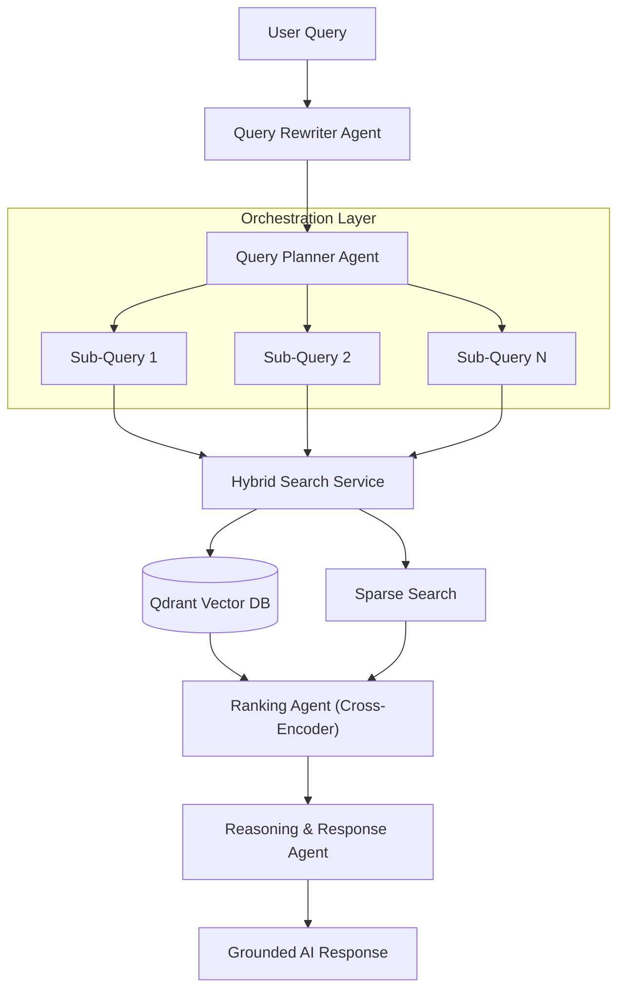

# InsightForge: Multi-Agent RAG Intelligence System


InsightForge is a high-performance Multi-Agent Retrieval-Augmented Generation (RAG) orchestrator designed for enterprise-grade document intelligence. It utilizes a sophisticated pipeline of specialized AI agents to decompose complex queries, retrieve high-density information, and synthesize grounded insights with multi-stage reasoning.

---

## System Architecture

The workflow follows an agentic orchestration pattern, moving from query decomposition to grounded synthesis.



---

## Agent Intelligence Matrix

| Agent Node | Specific Responsibility | Secondary Function | Core Model |
| :--- | :--- | :--- | :--- |
| **Query Rewriter** | Intent optimization | Keyword expansion | Gemini 2.0 Flash |
| **Query Planner** | Task decomposition | Multi-hop reasoning chain | Gemini 2.0 Flash |
| **Ranking Agent** | Semantic relevance scoring | Noise reduction | BGE-Reranker |
| **Reasoning Agent** | Grounded synthesis | Precise citation mapping | Gemini 2.0 Flash |

---

## Technical Features

### Modern Ingestion Pipeline
InsightForge implements a non-blocking stream model for high-density document ingestion.

1.  **Direct Stream Hijack**: Bypasses standard multipart parsing to handle files up to 500MB without network timeouts.
2.  **Recursive Semantic Chunking**: Documents are split into 800-token segments with a 200-token semantic overlap to maintain continuity.
3.  **Async Background Workers**: File parsing and vector indexing are offloaded to background threads for zero-latency UI response.

### 🧪 Tech Stack Components

- **Frontend Core**: Next.js 16 (Turbopack Enabled).
- **Backend Core**: FastAPI (Asynchronous Execution).
- **State Management**: React Context with Framer Motion animations.
- **Language Intelligence**: Google Gemini 1.5/2.0 Neural Clusters.
- **Vector Storage**: Qdrant (Distributed Vector Database).

---

## File Structure

```text
insightforge/
├── backend/            # FastAPI Source & API Endpoints
│   ├── agents/         # AI Agent Logic (Rewrite, Plant, Rank, Reason)
│   ├── services/       # Embedding, Vector DB, and External Clients
│   └── pipelines/      # Core RAG Orchestration Flow
├── frontend/           # Next.js Application & UI Interface
└── tests/              # Core System Verification Suite
```

---

## Getting Started

### Installation
```bash
# Clone the repository
git clone https://github.com/Pranesh-1/InsightForge.git

# Backend Setup
cd backend && pip install -r requirements.txt

# Frontend Setup
cd frontend && npm install
```

### Execution
Launch the backend and frontend services:
```bash
# Start Backend (Port 8002)
python -m uvicorn backend.main:app --port 8002

# Start Frontend
npm run dev
```

---

Dedicated to professional, grounded, and high-performance document intelligence.
